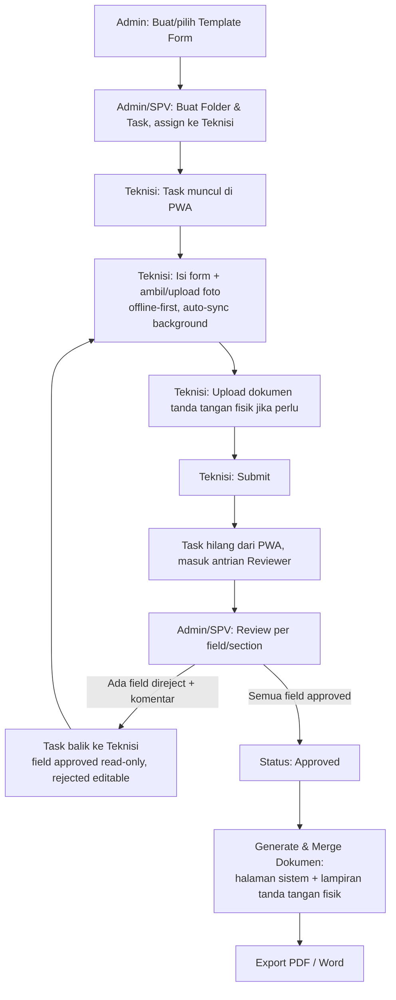

# Product Requirements Document (PRD) — Born Citius

**Versi:** 1.0
**Tanggal:** 29 Agustus 2026
**Status:** Final (hasil sesi requirement-gathering, siap untuk masuk fase desain teknis/implementasi)

---

## 1. Overview & Tujuan Produk

**Born Citius** adalah sistem digital untuk mengelola pekerjaan lapangan teknisi (job card / survey / BAST — Berita Acara Serah Terima) di lingkungan layanan infrastruktur telco/ISP (contoh: instalasi, UAT, BAST/BAR ke klien seperti "UAT PT MTM").

Saat ini proses tersebut dilakukan manual (form kertas/Word/Excel, foto tanpa metadata terverifikasi, tanda tangan basah discan terpisah, tidak ada alur approval terstruktur). Born Citius menggantikan proses ini dengan:

- **Web App** — dashboard untuk Admin/SPV membuat template form job card secara dinamis, mengelola assignment task ke teknisi, serta mereview dan menyetujui hasil pekerjaan sebelum menjadi dokumen resmi.
- **Mobile App (PWA)** — aplikasi berbasis browser untuk teknisi mengisi task di lapangan, mengambil foto bukti kerja dengan watermark otomatis, dan mengunggah semuanya secara real-time meski koneksi tidak stabil.

**Target pengguna:**
| Peran | Deskripsi |
|---|---|
| **Admin** | Mengelola seluruh sistem: template form, folder/task, user, dan approval final |
| **SPV** | Mengelola task dan approval untuk tim/folder yang menjadi tanggung jawabnya |
| **Teknisi** | Mengerjakan task di lapangan lewat PWA di HP Android |

**Tujuan utama:**
1. Menghilangkan form kertas dan proses manual rekap laporan lapangan.
2. Memastikan bukti foto pekerjaan otentik (watermark timestamp + GPS) dan tidak bisa dimanipulasi setelah diambil.
3. Menyediakan alur review/reject per kolom yang jelas, sehingga revisi tidak perlu mengulang seluruh form.
4. Menghasilkan dokumen BAST resmi (gabungan data digital + lampiran tanda tangan fisik) secara otomatis dalam format PDF/Word.

---

## 2. Scope

### In-Scope (v1)
- Dynamic form/task builder oleh Admin (tanpa perlu bantuan development untuk membuat template baru).
- Folder & task management (2 level: Folder → Task instance), assignment ke 1 teknisi per task.
- Pengisian task oleh teknisi lewat PWA, offline-first, auto-sync foto.
- Review per field/section dengan reject + komentar wajib, approval satu level.
- Watermark otomatis (timestamp + GPS + nama teknisi) untuk foto hasil kamera.
- Upload dokumen tanda tangan fisik (hasil scan/foto form yang sudah ditandatangani manual) dan penggabungan (merge) ke dokumen output akhir.
- **Output Layout dinamis** — editor block-list untuk menyusun tampilan dokumen PDF, terpisah dari Template sehingga satu template bisa punya beberapa layout berbeda (mis. per klien) — lihat Bagian 4.2.
- Export dokumen akhir dalam PDF (utama, hasil merge) dan Word (opsional, data mentah).
- User management dasar (CRUD Admin/SPV/Teknisi).
- Web Push notification untuk task baru & reject.
- Dashboard ringkas (jumlah task per status, daftar overdue).

### Out-of-Scope (v2+ / Future)
- Approval berjenjang (multi-level review, mis. SPV → Admin).
- Analitik performa teknisi / leaderboard.
- Aplikasi native / dukungan iOS.
- SSO perusahaan (Google Workspace/Azure AD), login OTP.
- Integrasi dengan sistem eksternal (ticketing, ERP, CRM) untuk sumber task otomatis.
- Multi-tenant (SaaS untuk banyak perusahaan klien terpisah).
- Notifikasi via SMS/WhatsApp.
- Tanda tangan digital di layar (signature pad) — v1 memakai upload dokumen fisik yang sudah ditandatangani.
- Dukungan multi-bahasa (v1 Bahasa Indonesia saja).

---

## 3. Roles & Permissions

| Permission | Admin | SPV | Teknisi |
|---|:---:|:---:|:---:|
| Membuat/mengedit template form (form builder) | ✅ | ❌ | ❌ |
| Membuat/mengedit Output Layout | ✅ | ❌ (hanya bisa memilih/assign layout yang ada) | ❌ |
| Membuat folder & task dari template | ✅ | ✅ (folder/tim miliknya) | ❌ |
| Assign task ke teknisi | ✅ | ✅ (folder miliknya) | ❌ |
| Mengisi task yang di-assign (termasuk revisi langsung saat review) | ✅ (task apa saja) | ✅ (folder miliknya) | ✅ (hanya task miliknya) |
| Review, reject per field, approve | ✅ | ✅ (folder yang jadi reviewer-nya) | ❌ |
| Export PDF/Word dokumen approved | ✅ | ✅ | ❌ |
| Kelola user (create/edit/nonaktifkan akun) | ✅ | ❌ | ❌ |
| Lihat seluruh folder/task di sistem | ✅ | ❌ (hanya folder miliknya) | ❌ (hanya task miliknya) |

Catatan: reviewer folder di-set default saat folder dibuat, namun bisa di-override per task instance untuk kasus khusus.

Admin dan SPV juga diberi akses **mengisi/mengedit langsung** field pada task yang sedang mereka review (lihat catatan "Revisi langsung oleh reviewer" di Bagian 4.4) — tujuannya agar koreksi kecil tidak perlu bolak-balik ke teknisi.

---

## 4. Web App — Admin Dashboard

### 4.1 Dynamic Form Builder

Admin membuat **Template** yang berisi kumpulan **field** tersusun dalam section. Tipe field yang didukung di v1:

| Tipe Field | Keterangan |
|---|---|
| Text | Input teks singkat |
| Number | Input angka |
| Date/Time | Tanggal & waktu |
| Dropdown (select) | Pilihan tunggal dari daftar |
| Radio button | Pilihan tunggal, tampil semua opsi |
| Checkbox | Pilihan ganda |
| Textarea | Teks panjang/catatan |
| Upload Foto | Ambil dari kamera (watermark otomatis) atau galeri (tanpa watermark) |
| Upload File | Dokumen pendukung (PDF/gambar) |
| Upload Dokumen Tanda Tangan Fisik | Field khusus untuk hasil scan/foto form yang sudah ditandatangani manual di atas kertas |
| GPS Auto-Capture | Lokasi otomatis terekam saat field diisi |
| Section/Header | Pemisah non-input untuk mengelompokkan field |
| Tabel Baris Berulang | Untuk daftar item yang jumlahnya dinamis (mis. daftar barang terpasang) |

Setiap field memiliki atribut: label, wajib/opsional, urutan, section, dan validasi dasar (mis. format angka).

**Template Versioning:** setiap kali template dipakai untuk membuat task instance, struktur field-nya di-*snapshot* ke task tersebut. Jika Admin mengedit template setelahnya (tambah/ubah/hapus field), task yang sudah berjalan **tidak berubah** — hanya task baru yang akan memakai struktur versi terbaru. Ini menjaga konsistensi data historis.

### 4.2 Output Layout — Editor Dinamis (Entity Terpisah dari Template)

Beda klien sering minta format laporan BAST yang berbeda meski data & template form-nya sama. Karena itu **Output Layout bukan bagian melekat dari Template** (1:1), melainkan **entity tersendiri yang reusable**:

- Satu **Layout** dibuat dengan merujuk ke satu **Template** sebagai sumber daftar field (field picker-nya diambil dari situ).
- Satu **Template** punya satu Layout **default**.
- Satu Template boleh punya **banyak Layout** (varian per klien), dan satu Layout hanya bisa dipakai untuk Template sumbernya.
- **Folder bisa override** Layout mana yang dipakai untuk kombinasi (Folder × Template) tertentu — pola identik dengan override Reviewer di Bagian 4.3: default di Template, override di Folder.

**Editor** berupa **kanvas WYSIWYG dengan drag & drop** — blok dirender menyerupai hasil cetaknya di atas "kertas" A4 dan bisa digeser langsung, dilengkapi **toolbar bergaya ribbon** (Sisipkan / Format / Tabel & Border) mirip pengolah kata. Diakses lewat menu tersendiri "Output Layout" (sejajar "Form Template" di navigasi). Jenis blok:

| Blok | Isi yang bisa diatur |
|---|---|
| **Teks** | Teks statis bebas (judul, paragraf, catatan) dengan ukuran, tebal/miring, dan perataan |
| **Gambar/Logo** | Gambar statis yang di-upload (logo perusahaan/klien), lebar bisa diatur |
| **Field** | Merujuk ke satu field dari Template sumber; label tampilan bisa di-override; gaya **bertumpuk**, **baris tabel**, atau **sebaris** |
| **Grid Field** | Beberapa field sekaligus sebagai grid label:value 1–2 kolom, border opsional |
| **Tabel** | Tabel dengan kolom yang bisa ditambah/dikurangi, baris kosong tambahan, warna latar & teks header, serta gaya border (semua garis / luar / dalam / tanpa garis) |
| **Halaman Foto** | Satu halaman berisi satu foto: pilih field foto sumber, caption (posisi atas/bawah), header box halaman (teks kiri & kanan), catatan halaman, dan border |
| **Lampiran Scan** | Menandai posisi *merge* halaman hasil scan yang di-upload teknisi — boleh lebih dari satu dan diletakkan **di mana saja**, termasuk sebagai halaman pertama |
| **Pemisah Halaman** | Memaksa konten berikutnya dimulai di halaman baru |
| **Header / Footer** | Logo, nama perusahaan, judul, nomor referensi / nomor halaman, catatan footer |

**Semua blok — termasuk Header, Footer, dan Lampiran Scan — bisa dihapus, diduplikasi, dan dipindah bebas** lewat drag & drop; tidak ada blok yang dipaksa hadir atau dikunci di posisi tertentu. Ini penting karena format tiap klien berbeda: ada yang menaruh dokumen bertanda tangan di halaman pertama, ada yang di akhir.

**Kanvas = preview multi-halaman A4**: seluruh layout berukuran **A4 potret**. Blok dirender dalam gaya cetak dan dikelompokkan menjadi halaman-halaman A4 terpisah bernomor, dengan kontrol zoom. Blok `photo-page` dan `attachment` masing-masing menempati satu halaman penuh; `page-break` memaksa halaman baru; blok lain mengalir dan otomatis pindah halaman saat tinggi A4 terlampaui — tinggi diukur dari DOM sungguhan sehingga mengikuti isi nyata.

**Dua jalur berbantuan AI** (lihat 8.3): **chat** untuk menyusun/mengubah layout lewat instruksi, dan **impor contoh** — unggah PDF/gambar laporan milik customer, lalu AI menyusun struktur blok-nya. Hasil AI selalu berupa **usulan** yang harus disetujui admin dan dapat dibatalkan setelah diterapkan; usulan yang tidak cocok dengan field template dibuang dan jumlahnya dilaporkan. Render PDF sungguhan tetap terjadi saat export nyata (Bagian 8, memerlukan library PDF di backend).

**Mekanisme merge dokumen akhir:** dokumen PDF final disusun **mengikuti urutan blok di layout**. Blok yang di-generate sistem (teks, field, tabel, halaman foto) dirender sebagai halaman baru, sementara tiap blok **Lampiran Scan** menyisipkan halaman-halaman hasil upload teknisi di posisinya. Contoh nyata dari format klien: halaman 1–9 berupa **template form milik customer** yang dicetak, diisi & ditandatangani manual lalu discan (sistem hanya menyediakan field upload-nya, tidak men-generate halaman itu), diikuti halaman-halaman foto ber-caption yang di-generate sistem.

### 4.3 Folder & Task Management

- Struktur 2 level: **Folder** (mis. "UAT PT MTM", "Task Last BAR") berisi banyak **Task instance**.
- Setiap task instance dibuat dari satu template dan di-assign ke **1 teknisi**.
- Reviewer folder ditentukan saat folder dibuat (Admin atau SPV tertentu); dapat di-override per task instance bila diperlukan.
- Output Layout yang dipakai untuk export dokumen mengikuti default Template, kecuali folder ini menetapkan override khusus untuk template tertentu (lihat Bagian 4.2).

### 4.4 Review & Approval Workflow

1. Teknisi submit task → status berubah menjadi **Submitted**, masuk ke antrian reviewer folder terkait.
2. Reviewer (Admin/SPV) membuka task, dapat **approve atau reject setiap field/section secara individual**.
3. Setiap reject **wajib disertai komentar** (alasan revisi).
4. Jika ada minimal satu field yang direject: tombol "Kirim balik ke Teknisi" aktif. Task kembali ke daftar task teknisi dengan:
   - Field yang sudah **approved** → tampil read-only.
   - Field yang **rejected** → tampil editable + di-highlight (merah) beserta komentar reviewer.
5. Teknisi mengedit ulang hanya bagian yang direject, lalu submit ulang → kembali ke langkah 2.
6. Jika **semua field approved**, reviewer klik **Approve** → task berstatus **Approved**, masuk ke halaman "Data Approved".
7. Di halaman Data Approved tersedia tombol **Export PDF** dan **Export Word**.

Approval bersifat **satu level** (tidak berjenjang) — approve dari reviewer folder bersifat final.

**Revisi langsung oleh reviewer:** selain reject (mengirim balik ke teknisi), Admin/SPV yang berperan sebagai reviewer juga bisa langsung **mengedit isi field** yang kurang tepat (mis. salah ketik, salah pilih opsi) tanpa perlu mengirim task itu balik ke teknisi. Ini mempercepat proses untuk koreksi kecil yang tidak substansial. Setiap perubahan yang dilakukan reviewer tercatat di audit trail (`REVIEW_LOG` dengan action `edit_field`), termasuk siapa yang mengedit, nilai sebelum dan sesudah — sehingga tetap terlacak bahwa data itu bukan input asli dari teknisi di lapangan.

### 4.5 User Management

CRUD akun untuk role Admin, SPV, dan Teknisi: nama, email/username, password, role, status aktif/nonaktif. Admin dapat menonaktifkan akun tanpa menghapus riwayat task yang sudah dikerjakan.

---

## 5. Mobile App (PWA) — Teknisi

### 5.1 Keputusan Arsitektur: Progressive Web App

Alih-alih aplikasi native yang harus di-install/update lewat Play Store, teknisi cukup membuka URL lalu opsional menambahkannya ke home screen ("Add to Home Screen") — tanpa proses instalasi maupun update manual.

| Aspek | Kenapa PWA cocok |
|---|---|
| Distribusi | Cukup buka link, tidak perlu Play Store |
| Update | Deploy sekali, semua teknisi otomatis dapat versi terbaru |
| Kamera + watermark | Didukung penuh via browser API + canvas |
| Offline & sync | Service Worker + IndexedDB + Background Sync API |
| Push notification | Web Push (didukung Chrome Android) |

**Scope v1:** Android + Chrome saja. **Trade-off yang diterima:** background sync bersifat *best-effort* — jika teknisi menutup total browser di lokasi tanpa sinyal sama sekali, sinkronisasi menunggu jadwal browser/OS saat sinyal kembali (bukan garansi instan seperti native background service), namun selama PWA dibuka saat bekerja, sync foto berjalan real-time seperti native.

### 5.2 Login & Multi-Device

Login dengan email/username + password (JWT). Satu akun teknisi **dapat digunakan di beberapa device sekaligus** (tidak ada device binding) — sistem menyimpan multiple active session per akun.

### 5.3 Daftar Task

Setelah login, teknisi hanya melihat task yang **di-assign khusus untuknya**. Jika tidak ada task yang di-assign, daftar kosong (tidak menampilkan task milik teknisi lain).

### 5.4 Pengisian Form

Form ditampilkan sesuai struktur template (field & section) yang dibuat Admin. Pengisian bersifat **offline-first**: seluruh input tersimpan lokal (IndexedDB) sehingga teknisi tetap bisa bekerja tanpa sinyal, lalu data disinkronkan otomatis begitu koneksi tersedia.

### 5.5 Upload Foto

| Aksi | Perilaku |
|---|---|
| **Take Photo** (kamera langsung) | Foto otomatis diberi **watermark burn-in**: timestamp, koordinat GPS, dan nama teknisi |
| **Upload** (dari galeri) | **Tanpa watermark visual** (asumsi sudah ada timestamp dari aplikasi pihak ketiga), namun waktu upload tetap dicatat sebagai metadata untuk audit trail |

Foto yang diambil/diupload **langsung disinkronkan ke server di background**, tanpa menunggu teknisi menekan tombol submit akhir — server sudah menampilkan foto tersebut secara real-time. Setiap foto punya indikator status sync (pending/synced/gagal-retry).

### 5.6 Upload Dokumen Tanda Tangan Fisik

Untuk field yang membutuhkan tanda tangan, teknisi mencetak halaman terkait, menandatanganinya secara fisik, lalu memfoto/scan hasilnya dan mengunggahnya lewat field khusus ini (mendukung foto jpg/png atau PDF, boleh lebih dari satu file/halaman). File ini yang nantinya digabung ke dokumen akhir (lihat 4.2).

### 5.7 Submit & Konflik Multi-Device

- Setelah semua field wajib terisi, teknisi klik **Submit** → task hilang dari daftar task di PWA-nya, dan masuk ke antrian review Admin/SPV di Web App.
- Karena satu akun bisa dipakai di banyak device, saat **device pertama berhasil sync** data task tertentu, task tersebut **dikunci di server** untuk device lain (device lain melihat status "sudah dikerjakan di device lain", tidak bisa menimpa).
- Jika device kedua sempat mengisi task yang sama secara offline sebelum tahu sudah dikunci, saat reconnect sistem menampilkan **peringatan konflik** dan meminta teknisi memilih data mana yang dipakai (tidak ada auto-merge otomatis antara dua isian berbeda).

### 5.8 Notifikasi

Web Push digunakan untuk memberi tahu teknisi saat: (1) task baru di-assign, (2) task dikembalikan karena ada field yang direject. Sebagai fallback alami, daftar task selalu menampilkan status terkini setiap kali PWA dibuka.

---

## 6. Alur End-to-End



---

## 7. ERD (Entity Relationship Diagram)

```mermaid
erDiagram
    USER ||--o{ FOLDER : "reviewer default"
    USER ||--o{ TASK_INSTANCE : "assigned teknisi"
    USER ||--o{ TASK_TEMPLATE : "dibuat oleh"
    USER ||--o{ DEVICE_SESSION : "punya"
    USER ||--o{ NOTIFICATION : "menerima"
    USER ||--o{ REVIEW_LOG : "melakukan review"

    FOLDER ||--o{ TASK_INSTANCE : "berisi"

    TASK_TEMPLATE ||--o{ TEMPLATE_FIELD : "mendefinisikan"
    TASK_TEMPLATE ||--o{ TASK_INSTANCE : "sumber snapshot"
    TASK_TEMPLATE ||--o{ OUTPUT_LAYOUT : "sumber field (1 template : N layout)"

    OUTPUT_LAYOUT ||--o{ LAYOUT_BLOCK : "berisi"
    TEMPLATE_FIELD ||--o{ LAYOUT_BLOCK : "direferensikan oleh blok tipe field"
    OUTPUT_LAYOUT ||--o{ FOLDER_LAYOUT_OVERRIDE : "dipilih sebagai override"
    FOLDER ||--o{ FOLDER_LAYOUT_OVERRIDE : "override per template"
    TASK_TEMPLATE ||--o{ FOLDER_LAYOUT_OVERRIDE : "untuk kombinasi folder+template ini"

    TASK_INSTANCE ||--o{ TASK_INSTANCE_FIELD : "snapshot field + jawaban"
    TASK_INSTANCE ||--o{ REVIEW_LOG : "riwayat"
    TASK_INSTANCE ||--o| GENERATED_DOCUMENT : "menghasilkan"
    OUTPUT_LAYOUT ||--o{ GENERATED_DOCUMENT : "dipakai sebagai layout export"

    TASK_INSTANCE_FIELD ||--o{ ATTACHMENT : "lampiran (foto/file/ttd)"

    USER {
        uuid id PK
        string name
        string email
        string password_hash
        enum role "admin | spv | teknisi"
        boolean is_active
        datetime created_at
    }

    FOLDER {
        uuid id PK
        string name
        string client_name
        uuid default_reviewer_id FK
        uuid created_by FK
        datetime created_at
    }

    TASK_TEMPLATE {
        uuid id PK
        string name
        string description
        int version
        boolean is_active
        uuid created_by FK
        datetime created_at
    }

    OUTPUT_LAYOUT {
        uuid id PK
        string name
        uuid source_template_id FK
        boolean is_default
        uuid created_by FK
        datetime created_at
    }

    LAYOUT_BLOCK {
        uuid id PK
        uuid layout_id FK
        enum type "text|image|field|field-grid|table|photo-page|attachment|page-break|header|footer"
        string label
        uuid source_field_id FK "nullable — field sumber untuk type field/photo-page/attachment"
        enum display_style "stacked|table-row|inline, nullable"
        int order_index
        json text_style "fontSize, bold, italic, align, color"
        json border "outer, inner, width, color"
        json config "properti spesifik tipe blok: content, image_url, field_ids, columns, rows, empty_rows, header_bg_color, caption, page_header, note_text, dll"
    }

    FOLDER_LAYOUT_OVERRIDE {
        uuid folder_id FK
        uuid template_id FK
        uuid layout_id FK
    }

    TEMPLATE_FIELD {
        uuid id PK
        uuid template_id FK
        string label
        enum field_type
        json options
        boolean is_required
        string section
        int order_index
    }

    TASK_INSTANCE {
        uuid id PK
        uuid folder_id FK
        uuid template_id FK
        int template_version_snapshot
        uuid assigned_teknisi_id FK
        uuid reviewer_override_id FK "nullable"
        enum status "assigned|in_progress|submitted|rejected|approved"
        string locked_by_device_id "nullable"
        datetime due_date
        datetime submitted_at
        datetime approved_at
        datetime created_at
    }

    TASK_INSTANCE_FIELD {
        uuid id PK
        uuid task_instance_id FK
        string field_key
        string label
        enum field_type
        json options
        boolean is_required
        string section
        int order_index
        json value
        enum review_status "pending|approved|rejected"
        string reject_comment
        uuid reviewed_by FK
        datetime reviewed_at
        uuid last_edited_by FK "nullable, terisi jika direvisi langsung oleh reviewer"
        datetime last_edited_at
    }

    ATTACHMENT {
        uuid id PK
        uuid task_instance_field_id FK
        enum type "photo_taken|photo_uploaded|file_uploaded|signed_document"
        string file_url
        json watermark_metadata "gps, timestamp, nama_teknisi"
        enum sync_status "pending|synced|failed"
        datetime captured_at
        datetime synced_at
    }

    GENERATED_DOCUMENT {
        uuid id PK
        uuid task_instance_id FK
        uuid layout_id FK "layout yang berlaku saat generate (hasil resolve default/override)"
        string pdf_url
        string word_url
        json merged_attachment_ids
        datetime generated_at
    }

    REVIEW_LOG {
        uuid id PK
        uuid task_instance_id FK
        uuid reviewer_id FK
        uuid task_instance_field_id FK "nullable, null jika approve keseluruhan"
        enum action "approve_field|reject_field|approve_all|edit_field"
        string comment
        json previous_value "terisi untuk action edit_field, menyimpan nilai sebelum diubah reviewer"
        datetime created_at
    }

    DEVICE_SESSION {
        uuid id PK
        uuid user_id FK
        string device_id
        string push_subscription
        datetime last_active_at
    }

    NOTIFICATION {
        uuid id PK
        uuid user_id FK
        enum type "task_assigned|task_rejected"
        string message
        boolean is_read
        datetime created_at
    }
```



**Catatan desain kunci:**
- `TASK_INSTANCE_FIELD` adalah gabungan snapshot struktur field (dari `TEMPLATE_FIELD` versi saat itu) **dan** jawaban teknisi **dan** status review — sehingga task lama tidak pernah rusak walau template induknya diubah/di-versi ulang.
- `ATTACHMENT.watermark_metadata` hanya terisi untuk `photo_taken`; untuk `photo_uploaded` dan `signed_document`, watermark visual kosong tapi `captured_at`/`synced_at` tetap tercatat untuk audit.
- `GENERATED_DOCUMENT` hanya dibuat setelah `TASK_INSTANCE.status = approved`, merangkum halaman generate + `attachment` bertipe `signed_document`.
- `TASK_INSTANCE_FIELD.last_edited_by`/`last_edited_at` dan `REVIEW_LOG.action = edit_field` mendukung skenario **Admin/SPV merevisi langsung** isi field saat review (bukan hanya reject-lalu-kirim-balik), tetap dengan jejak audit siapa yang mengubah dan nilai sebelumnya.
- `OUTPUT_LAYOUT` sengaja dipisah dari `TASK_TEMPLATE` (bukan kolom `output_layout_config` yang menempel di template seperti draf awal) supaya satu template bisa dipakai lintas klien dengan tampilan dokumen yang berbeda-beda, tanpa perlu duplikasi template.
- `FOLDER_LAYOUT_OVERRIDE` (composite key `folder_id + template_id`) meniru pola `TASK_INSTANCE.reviewer_override_id`: resolusi layout yang dipakai saat generate = cek override folder+template dulu, baru fallback ke `OUTPUT_LAYOUT.is_default` milik template tsb.
- `LAYOUT_BLOCK.source_field_id` hanya boleh menunjuk ke `TEMPLATE_FIELD` milik `source_template_id` yang sama dengan `OUTPUT_LAYOUT`-nya, dengan tipe field yang sesuai per jenis blok: `type=field`/`field-grid` → field data biasa (bukan lampiran), `type=photo-page` → field `photo`, `type=attachment` → field `signed_document`.
- Urutan `LAYOUT_BLOCK.order_index` menentukan urutan halaman dokumen final, termasuk posisi penyisipan halaman hasil scan — sebuah blok `attachment` di `order_index` paling awal berarti dokumen customer menjadi halaman pertama.

---

## 8. Tech Stack

| Layer | Pilihan | Alasan |
|---|---|---|
| Web Admin Dashboard | **Next.js (React)** | SSR/SEO tidak krusial tapi ekosistem matang, mudah share komponen dengan PWA teknisi |
| Mobile "App" Teknisi | **Next.js PWA** (Service Worker, IndexedDB/Dexie.js, Background Sync API, Web Push) | Menghindari instalasi APK/Play Store, berbagi design system dengan Admin Web |
| Backend API | **NestJS** (Node.js/TypeScript) | Struktur modular, cocok untuk domain kompleks (template versioning, workflow review) |
| Database | **PostgreSQL** | Relasional, cocok untuk skema ERD di atas, mendukung JSONB untuk field dinamis |
| Object Storage | **MinIO** (self-hosted, S3-compatible) | Penyimpanan foto & dokumen dalam jumlah besar, jalan sebagai container di VPS yang sama |
| Arsip/Mirror | **Google Drive via rclone** | Salinan otomatis foto & dokumen untuk arsip dan berbagi ke klien — lihat 8.2. Storage lokal tetap primary |
| AI Layout Assistant | **n8n → Claude Bridge → Claude CLI** | Menyusun/mengekstrak layout output; credential tetap di host, lihat 8.3 |
| Autentikasi | **JWT (access + refresh token)**, multi-session per user | Mendukung login multi-device tanpa device binding |
| PDF/Word Generation & Merge | Library merge PDF (mis. pdf-lib) untuk gabung halaman generate + lampiran; converter untuk export Word | Mendukung kebutuhan merge halaman sistem + halaman fisik hasil scan |
| Push Notification | **Web Push (VAPID)** | Native ke browser Chrome Android, tanpa perlu FCM app native |
| Cache/Queue | **Redis + BullMQ** | Antrian job async (kompres foto, merge PDF, kirim Web Push) dijalankan oleh service `worker` terpisah |
| Reverse Proxy/TLS | **Traefik** (atau Nginx + Certbot) | Terminasi HTTPS otomatis (Let's Encrypt) — wajib karena PWA butuh secure context untuk Service Worker, kamera, dan GPS |
| Hosting | **VPS + Docker Compose** (self-hosted) | Kontrol biaya & operasional sederhana untuk skala v1 — lihat detail arsitektur di 8.1 |

### 8.1 Arsitektur Deployment (Docker Compose di VPS)

Seluruh stack dijalankan dari satu `docker-compose.yml` di atas **satu VPS** (rekomendasi awal: 4 vCPU / 8GB RAM, sesuai skala puluhan-ratusan teknisi di Bagian 10). Service yang berjalan:

| Service | Image/basis | Peran |
|---|---|---|
| `reverse-proxy` | Traefik | Terminasi TLS otomatis (Let's Encrypt), routing domain/subdomain ke tiap service |
| `web-admin` | Next.js (custom image, multi-stage build) | Admin/SPV dashboard |
| `web-teknisi` | Next.js PWA (custom image terpisah) | App teknisi — dipisah dari `web-admin` agar manifest.json & service worker scope PWA tetap bersih, meski berbagi package UI lewat monorepo |
| `api` | NestJS (custom image) | REST API utama |
| `worker` | Image sama dengan `api`, mode worker | Job async: kompres foto pasca-approve, merge PDF, kirim Web Push |
| `postgres` | `postgres:16` official image | Database, dengan volume persisten |
| `redis` | `redis:7` official image | Queue (BullMQ) untuk `worker` + cache ringan |
| `minio` | MinIO official image | Object storage S3-compatible untuk foto/dokumen |
| `backup` | Cron container kecil (`pg_dump` + `mc` MinIO client) | Terjadwal backup database + mirror bucket MinIO ke storage off-site (mis. Backblaze B2/S3 murah) |

**Kenapa backup off-site penting:** karena retensi data bersifat permanen (Bagian 10) sementara VPS tunggal tidak punya redundansi bawaan seperti layanan cloud managed — backup terjadwal ke lokasi terpisah adalah mitigasi utama terhadap kegagalan VPS.

**Struktur repo:** monorepo (pnpm workspaces/Turborepo) — `apps/web-admin`, `apps/web-teknisi`, `apps/api`, `packages/ui` (shared design system, lihat Bagian 9.2), masing-masing app punya Dockerfile sendiri.

**CI/CD:** GitHub Actions build image tiap app → push ke registry (GHCR) → SSH ke VPS menjalankan `docker compose pull && docker compose up -d`. Deploy dipicu terkontrol lewat CI (bukan auto-pull Watchtower) supaya rollout bisa diverifikasi dulu.

**Environment/secrets:** file `.env` di VPS (tidak masuk git), dipisah per environment jika ada staging.

### 8.2 Mirror Google Drive

Foto yang diunggah teknisi dan dokumen hasil export disalin ke Google Drive
sebagai **arsip**, sementara storage lokal/MinIO tetap **primary** untuk
penyajian di aplikasi (cepat, tanpa rate limit API Drive).

Struktur folder:

```
BORN CITIUS/{Nama Folder Klien}/{SiteID}_{taskId}/{Judul Field Foto}/{berkas}
```

Penyalinan berjalan sebagai job antrian (BullMQ) sehingga tidak memblokir upload
teknisi. Kegagalan di-retry dengan backoff; bila tetap gagal, `Attachment.syncStatus`
menjadi `failed` beserta pesan errornya — tidak pernah dianggap sukses diam-diam.
Implementasi memakai `rclone` dengan remote yang sudah terkonfigurasi di server;
`root folder id` diberikan lewat flag sehingga `rclone.conf` milik user tidak diubah.
Antarmuka `DriveMirrorService` sengaja kecil agar bisa diganti implementasi
`googleapis` bila binary eksternal tidak diinginkan saat kontainerisasi.

### 8.3 AI Layout Assistant

```
web-admin  →  n8n webhook  →  Claude Bridge (host)  →  Claude CLI
```

Credential Claude tersimpan di `~/.claude` milik user host, sedangkan n8n dan API
berjalan di container — karena itu **Claude Bridge** berjalan di host sebagai
pemilik credential, dan container menghubunginya lewat gateway Docker. n8n
berperan sebagai orkestrator: menyusun prompt, retry, dan menyimpan riwayat
eksekusi; prompt dapat disetel dari n8n tanpa deploy ulang aplikasi.

Pengamanan bridge: token wajib (dibandingkan konstan-waktu), tool Claude yang
berbahaya dimatikan (hanya `Read` aktif), akses berkas dibatasi ke satu direktori
yang divalidasi setelah `resolve()`, dan argumen dikirim sebagai array ke `spawn`
(tidak lewat shell).

**Catatan langganan**: akun claude.ai ditujukan untuk pemakaian interaktif oleh
pemegang akun. Beban fitur ini kecil (hanya Admin, sesekali), namun bila aplikasi
melayani banyak pengguna, jalur resminya adalah API key berbayar — cukup mengganti
adapter di `apps/web-admin/src/lib/ai/`.

**Catatan sementara**: endpoint AI saat ini berupa Route Handler Next.js di
`apps/web-admin`, bukan NestJS, karena dibangun sebelum backend ada. Akan dipindah
ke `apps/api` saat modul terkait dikerjakan.

---

## 9. UI/UX Design Plan

### 9.1 Prinsip Desain

- **Gaya visual:** modern minimalis/korporat — palet netral (grayscale) + satu warna aksen brand, whitespace lega, tipografi sans-serif (mis. Inter), radius medium konsisten di seluruh komponen.
- **Tema:** **light mode saja di v1** (dark mode ditunda ke v2).
- **Admin Web:** dioptimalkan untuk desktop, data-dense (tabel, form kompleks, banyak informasi per layar).
- **Teknisi PWA:** mobile-first — dioperasikan satu tangan, tombol besar, kontras tinggi supaya tetap terbaca di bawah sinar matahari langsung saat teknisi bekerja di lapangan.

### 9.2 Design System Bersama

Karena Admin Web dan Teknisi PWA sama-sama dibangun dengan Next.js, keduanya berbagi satu component library (`packages/ui` di monorepo) berbasis **Tailwind CSS + shadcn/ui** — dipilih karena kompatibel langsung dengan pola komponen yang tersedia di 21st.dev.

### 9.3 Referensi Komponen — 21st.dev via MCP

Server MCP **`21st`** (marketplace komponen React/Tailwind/shadcn) sudah terpasang untuk project ini. Selama implementasi frontend, tim mencari dan mengadaptasi pola komponen siap pakai dari 21st.dev lewat MCP ini — alih-alih membangun setiap komponen dari nol — untuk mempercepat pembangunan UI sekaligus menjaga kualitas visual yang konsisten. Ini merupakan bagian dari *workflow* pengembangan tim frontend, bukan dependency runtime aplikasi.

**Layar/komponen kunci yang dicari referensinya di 21st.dev:**

*Admin Web:*
- Sidebar navigasi + topbar
- Stat card ringkasan status task
- Data table dengan filter/sort/pagination (daftar task, folder, user)
- Folder/kanban browser
- Drag-and-drop form builder canvas + panel properti field
- Editor Output Layout: block-list (bukan canvas bebas posisi) + panel properti per blok + preview approksimasi halaman A4 (lihat Bagian 4.2)
- Tampilan review: approve/reject + komentar menyatu di dalam tiap field (bukan panel terpisah), highlight field rejected
- Modal/dialog CRUD user
- Toast/notification banner

*Teknisi PWA:*
- Daftar task bergaya card mobile + badge status
- Bottom navigation
- Layout form bertahap per section
- Layar kamera dengan overlay preview watermark
- Komponen dropzone upload file/dokumen tanda tangan
- Indikator progress/status sync foto (pending/synced/failed)
- Tombol submit + halaman konfirmasi
- Prompt izin push notification

**Alur kerja desain → kode:** untuk setiap layar di atas, cari komponen relevan di 21st.dev lewat MCP `21st`, sesuaikan token warna/spacing/radius ke design system Born Citius (Bagian 9.1–9.2), baru diintegrasikan ke codebase.

---

## 10. Non-Functional Requirements

- **Retensi data:** dokumen & foto disimpan **permanen** (dokumen legal/audit klien). Foto resolusi asli dikompres otomatis setelah task berstatus *approved* untuk efisiensi storage, tanpa mengorbankan kualitas keterbacaan.
- **Keamanan:** password di-hash (bcrypt/argon2), seluruh komunikasi via HTTPS, akses data dibatasi berbasis role (RBAC) sesuai matrix di Bagian 3.
- **Audit trail:** setiap aksi approve/reject tercatat di `REVIEW_LOG` (siapa, kapan, field mana, komentar apa) — tidak bisa dihapus.
- **Bahasa:** Bahasa Indonesia untuk seluruh antarmuka (v1).
- **Skala target:** single-tenant internal, estimasi puluhan hingga ratusan teknisi aktif, dengan volume ratusan task per bulan.
- **Ketersediaan offline:** PWA teknisi harus tetap dapat digunakan (isi form, ambil foto) tanpa koneksi internet aktif, dengan antrian sync otomatis.

---

## 11. Dashboard & Metrics (v1)

Dashboard Admin/SPV menampilkan:
- Jumlah task per status (*assigned / in_progress / submitted / rejected / approved*) per folder.
- Daftar task yang **overdue** atau sudah lama menunggu direview tanpa tindakan.

*(Analitik performa per teknisi, tren waktu penyelesaian, dsb. direncanakan untuk v2.)*

---

## 12. Out of Scope / Future (v2+)

- Approval berjenjang (multi-level review).
- Analitik & leaderboard performa teknisi.
- Dukungan iOS / aplikasi native.
- SSO perusahaan & login OTP.
- Integrasi otomatis dengan sistem ticketing/ERP/CRM sebagai sumber task.
- Multi-tenant (SaaS lintas perusahaan).
- Notifikasi via SMS/WhatsApp.
- Tanda tangan digital di layar (signature pad) menggantikan proses tanda tangan fisik.
- Dukungan multi-bahasa.

---

*Dokumen ini disusun berdasarkan sesi requirement-gathering interaktif dan mencerminkan seluruh keputusan yang telah disepakati. Perubahan scope di luar dokumen ini perlu didiskusikan ulang sebelum masuk fase development.*
